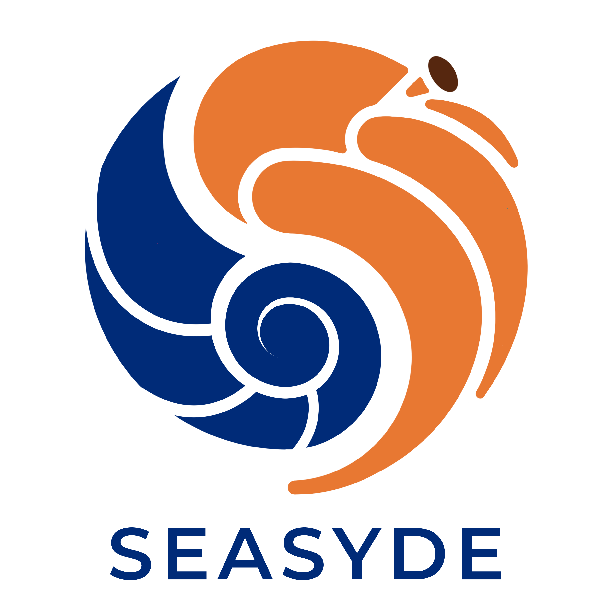

<div align="left" width=fit-content><h1> SeaSyde 🏖🏝 </h1></div>

`SeaSyde` (**S**eries **E**xpansion **A**pproach for **SY**stem of **D**ifferential **E**quation) is a `Mathematica` package for solving the system of differential equation, associated to the Master Integrals of a given topology.

In particular, it solves the system of differential equations using a series expansion approach. This means that the solution is given as a series in the kinematical variables. `SeaSyde` automatically performs the analitic continuation from the euclidean region, where usually the boundary conditions are imposed, to the physical region by moving in the complex plane associated to each kinematic variable. This way of performing the analytic continuation let us evaluate the master integrals with arbitrary internal complex masses in a straightforward way. 

This package is based on the work presented [here](https://arxiv.org/abs/2205.03345).

## Usage 🛠⚙️
In order to use `SeaSyde` first download `SeaSyde.m`. Then you can import it in a notebook using
``` 
  Get["/path/to/SeaSyde.m"]
```

Some working examples are available in the `Example/` folder. 

To see all the availbale functions, use:
``` 
  ?SeaSyde`*
```

## Support 🆘🚧
For any problem, comment or suggestion, please contact [Tommaso Armadillo](mailto:tommaso.armadillo@uclouvain.be) or open an issue here oh GitHub.
